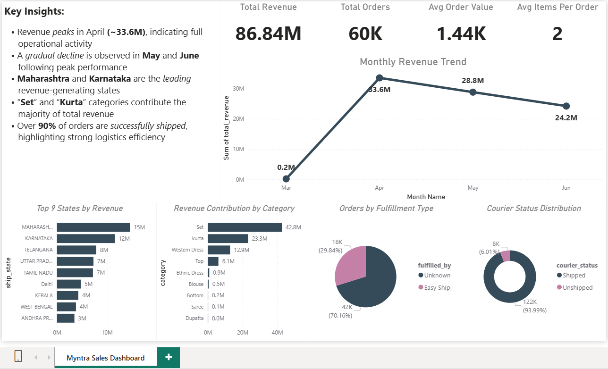

# 🛍️ Myntra Sales Data Analysis & Dashboard

---

## 📸 Dashboard Preview



---

## 📌 Project Overview

This project analyzes Myntra sales data to uncover key business insights related to revenue trends, customer behavior, product performance, and logistics efficiency.

The workflow covers **data cleaning, validation, SQL analysis, and dashboard visualization**, showcasing an end-to-end data analytics pipeline.

---

## ❓ Business Problem

E-commerce platforms like Myntra generate large volumes of sales data, but without proper analysis, it is difficult to extract actionable insights.  

This project aims to analyze sales data to identify revenue drivers, customer behavior patterns, and operational efficiency.

---

## 🎯 Objectives

* Analyze sales performance over time
* Identify top-performing states and product categories
* Evaluate order patterns and customer behavior
* Assess logistics performance (shipping & fulfillment)
* Build an interactive business dashboard for insights

---

## 🛠️ Tech Stack

* **Python (Google Colab)** → Data cleaning & validation
* **PostgreSQL + pgAdmin** → Data storage & SQL analysis
* **Power BI** → Dashboard & visualization

---

## 📂 Project Structure

```
myntra-sales-analysis/
│
├── data/                     # Raw & cleaned datasets
├── notebooks/                # Python cleaning scripts (Colab)
├── sql/                      # SQL queries & views
├── dashboard/
│   └── myntra_dashboard.pbix
├── images/
│   └── dashboard.png        # Dashboard preview
└── README.md
```

---

## 🧹 Data Cleaning & Validation

Performed using Python:

* Removed invalid date records
* Checked for negative quantities and amounts
* Handled missing values
* Ensured data consistency before loading into PostgreSQL

---

## 🗄️ SQL Analysis

Key metrics calculated:

* Total Revenue
* Total Orders
* Average Order Value (AOV)
* Average Items per Order
* Monthly Revenue Trends
* Revenue by Category
* Top States by Revenue
* Fulfillment & Courier Analysis

Example:

```sql
SELECT SUM(revenue) AS total_revenue
FROM myntra_sales;

SELECT SUM(revenue) / COUNT(DISTINCT order_id) AS avg_order_value
FROM myntra_sales;
```

---

## 📊 Dashboard Overview

### 🔑 Key Metrics

* **Total Revenue:** 86.84M
* **Total Orders:** 60K
* **Avg Order Value:** 1.44K
* **Avg Items per Order:** 2

### 📈 Visuals Included

* Monthly Revenue Trend
* Top States by Revenue
* Revenue Contribution by Category
* Orders by Fulfillment Type
* Courier Status Distribution

---

## 🧠 Key Insights

* Revenue peaks in **April (~34M)**, indicating full operational activity
* A gradual decline is observed in **May and June** following peak performance
* **Maharashtra and Karnataka** are the leading revenue-generating states
* **“Set” and “Kurta”** categories contribute the majority of total revenue
* Over **90% of orders are successfully shipped**, highlighting strong logistics efficiency

---

---

## 🚀 How to Run This Project

1. Clean data using Python (Colab notebook)
2. Load cleaned data into PostgreSQL
3. Run SQL queries for analysis
4. Connect Power BI to PostgreSQL
5. Build dashboard using visuals

---

## 📌 Key Learnings

* End-to-end data analytics workflow
* Data validation and cleaning techniques
* Writing analytical SQL queries
* Designing business-focused dashboards
* Translating data into actionable insights

---

## 💼 Why This Project Matters

This project demonstrates the ability to:

* Work with real-world datasets
* Perform structured data analysis
* Build professional dashboards
* Communicate insights effectively

---

## 📬 Contact

Feel free to connect or reach out for feedback!

---
